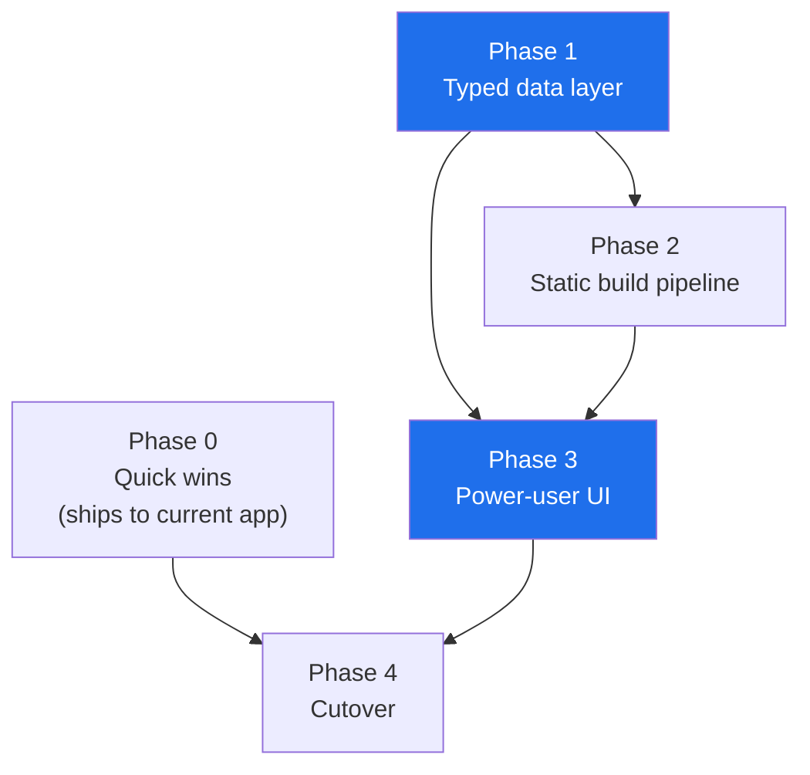

# Modernization Roadmap

Written 2026-08-06, after the refactor pass that took the codebase from
`c96bd44` to `d046134`.

**Fixed constraints**

- The data source stays the [Thriplerex AM5 spreadsheet](https://docs.google.com/spreadsheets/d/1NQHkDEcgDPm34Mns3C93K6SJoBnua-x9O-y_6hv8sPs). No scraping, no second source.
- The audience is power users: people who care about VRM phase counts, PCIe
  lane sharing and USB tiers. Depth over simplification.

**Agreed direction**

- Target architecture: **static data app** — a build step emits typed data plus
  a client bundle, served from a CDN. No runtime server.
- Frontend: **Svelte + TanStack Table** (headless grid).

---

## Why this shape

The app is a read-only browser over a dataset that changes only when the
spreadsheet changes. No accounts, no writes, no per-user state. The complete
dataset is **114 KB gzipped**. There is no work for a server to do at request
time that can't be done once at build time.

Three measured facts drive the sequencing below.

| Measurement | Value | Consequence |
| --- | --- | --- |
| Spec leaf fields | 205 | The data model is wide, so the grid must virtualize columns as well as rows |
| Fields that are numeric but stored as strings | 46 | No range filters are possible today; scoring re-parses text repeatedly |
| Index payload, uncompressed | 2.68 MB | Prod sends this with no `Content-Encoding`; gzip takes it to 118 KB |
| Rear I/O images on disk | 611 files, 171 MB | Rendered at 50 px; a 10-board compare can pull ~3 MB of PNG for thumbnails |

The untyped data is the root constraint. Range filters, consistent scoring and
a compact client payload all depend on it, which is why Phase 1 comes before
any frontend work.

---

## Phase dependencies



Phase 0 is independent and ships against the Flask app that exists today.
Phases 1 and 3 are where the real value is; 2 and 4 are plumbing.

---

## Phase 0 — Quick wins  *(size: S)*

Independent of every other decision. Worth doing immediately because the
current app stays in production until Phase 4.

- **Enable compression.** `flask-compress` on the Flask app, or serve through
  something that compresses. 2.68 MB → 118 KB, a 22× reduction on the single
  heaviest response in the app.
- **Generate image thumbnails at ingest.** The loader already writes the PNGs;
  have it also emit a ~200 px WebP alongside. The table uses the thumbnail, the
  modal keeps the full image. Expect the 171 MB asset set to drop by well over
  an order of magnitude for the common path.
- **Cache headers** on `/static/**` — these are content-addressed by board id
  and change only on rebuild.

**Exit criteria:** index transfers under 150 KB; a 10-board compare pulls under
300 KB of imagery.

---

## Phase 1 — Typed data layer  *(size: L — the foundation)*

Keep `openpyxl` and the existing header parser. They are hard-won and now
tested; the problem is not extraction, it is that nothing describes or
validates what comes out.

**Column registry.** A declarative table: sheet header path → canonical field
name, type, unit, whether required. This is the same idea as
`services/compare_layout.py`, applied to ingest.

```
"General|Market|A-MSRP (USD)"  → price_usd        : int    | required
"Expansion|Storage|SATA"       → sata_ports       : int
"Power|VRM configuration|..."  → vrm_phases       : phase_config
"General|Networking|...|LAN"   → lan_controllers  : list[controller]
```

**Typed parsers**, one per type, unit-tested in isolation: integer, decimal,
currency, enum, boolean, phase config (`2x8+2+1`), link speed (`2.5GbE`),
count-with-qualifier, list.

**Validation gates.** The build fails, loudly, when:
- a required column is missing or its header moved
- a value doesn't parse under its declared type
- the discovered header tree disagrees with the registry
- two boards resolve to the same id (already in place, `loaders/ids.py`)

This is the direct answer to the heuristic parser silently mis-reading a
reorganized sheet.

**Change report.** Diff each build against the previous one and emit
`build-meta.json`: boards added/removed, columns renamed, values changed,
anything unparseable. This is both a safety net and the raw material for the
"what's new" UI in Phase 3.

**Derived scoring becomes typed.** `_scorecard` stops being text re-parsed at
several layers and becomes a function of typed fields, computed once. This
retires the last of the duplicated scoring logic that step 4 started on.

**Retire `DotWrapper`.** It exists to fuzzily probe an untyped blob and returns
blank on a miss. With a schema, field access is direct and a typo is an error.

**Outputs:** `boards.json` (typed), `schema.json`, `build-meta.json`.

**Exit criteria:** every one of the 205 fields is either in the registry or
explicitly marked ignored; a deliberately corrupted sheet fails the build with
a useful message; `DotWrapper` is gone.

---

## Phase 2 — Static build pipeline  *(size: M)*

- Vite + Svelte skeleton; Python ingest becomes a build step that emits the
  data artifacts.
- Re-emit existing declarative data as JSON rather than porting it by hand —
  `COMPARE_LAYOUT` and `USB_SPEED_BADGES` are already plain data structures,
  which is precisely why steps 3 and 4 were worth doing first.
- Prerender: index shell, `/board/<id>` per board, compare page.
- Deploy to Cloudflare Pages (or GCS + CDN). Forgejo CI already rebuilds on
  data change — point it at the new build.
- Flask app keeps running in parallel; nothing is switched over yet.

**Exit criteria:** the static build renders the same board set as the Flask app
and is deployed to a preview URL.

---

## Phase 3 — Power-user UI  *(size: L — the visible payoff)*

Built on TanStack Table (headless), so the grid behaviour is library-provided
and the presentation stays ours.

**Grid**
- Virtualized rows *and* columns — 205 × 613 must stay smooth
- Arbitrary column selection, replacing today's fixed four dynamic columns
- Column reorder, pin, resize; multi-column sort
- Presets: "VRM deep-dive", "Connectivity", "Budget", "Storage"

**Filtering** — the biggest functional gap today, and the reason Phase 1 comes
first. Currently every filter is exact-match set membership.
- Numeric ranges and comparisons: `price < 400`, `m2 >= 4`
- Presence/absence: `has usb4`, `no wifi`
- Set membership (what exists today)
- A compact query syntax over typed fields, with a builder UI for discovery:
  `chipset:X870E m2>=4 usb4>0 price<400`

**Compare, rebuilt**
- Diff-first by default rather than a toggle
- Pin a reference board; show other boards as deltas against it
- Section collapse (carry over from today)
- Export current view as CSV / Markdown / JSON

**Interaction**
- Keyboard-first: `/` search, `j`/`k` move, space select, `c` compare, `?` help
- Dark mode — this is a tool people stare at for a long time
- Readable permalinks for filter state, replacing the base64 `?v=` blob

**Freshness** — surface `build-meta.json`: "sheet fetched 3 days ago; 12 boards
added, 3 specs corrected since your last visit."

**Exit criteria:** every filter type above works against typed fields; the grid
stays responsive with all columns shown; compare export round-trips.

---

## Phase 4 — Cutover  *(size: M)*

- Parity checklist against the Flask app, using the same
  capture-render-and-diff harness that verified steps 3–5.
- **URL compatibility:** `/compare?ids=...` keeps working unchanged. Because
  step 5 made ids content-based, they carry over to the static app as-is —
  there is no third round of broken share links.
- Retire the Flask app, or keep it as a local ingest/dev tool.
- Optional: PWA/offline. The dataset is 114 KB; this is nearly free.

---

## Testing through the transition

The current suite is 212 tests in ~41 s. It does not all survive, and that is
fine — but the split should be deliberate:

| Area | Fate |
| --- | --- |
| Ingest, loaders, ids, schema | **Keep and grow** — this is the durable half |
| `test_compare_layout.py` path validation | **Keep**, retargeted at the registry |
| Jinja/template tests | Retire at cutover |
| `test_table_logic.py`, `test_js_logic.py` | **Port to Vitest**, they are already pure-function tests |
| Playwright e2e | **Keep**, retargeted at the static build |

The HTML capture-and-diff harness used in steps 3–5 should be kept and pointed
at the static build during Phase 4 — it caught several regressions that the
test suite did not.

---

## Risks

| Risk | Mitigation |
| --- | --- |
| Sheet reorganization breaks ingest | Precisely what Phase 1's validation gates exist to catch — it becomes a loud build failure instead of silent blank columns |
| Rewrite loses subtle behaviour | Parity checklist plus the render-diff harness; phases ship independently so nothing is big-bang |
| Frontend rewrite outruns the data layer | Phase 1 before Phase 3, deliberately — building range filters against strings means building them twice |
| Scope creep into a "product" | Out-of-scope list below is binding |

## Explicitly out of scope

- Any data source other than the Thriplerex sheet — no scraping, no price APIs,
  no retailer stock
- User accounts, saved profiles, server-side state
- Rewriting the openpyxl header parser (add a schema on top; don't replace it)
- Simplifying the spec depth for a general audience — the depth is the product

---

## Suggested order

`Phase 0` → `Phase 1` → `Phase 2` → `Phase 3` → `Phase 4`

Phase 0 can ship this week and is independent. Phase 1 is the largest single
piece of work and everything else compounds on it.
